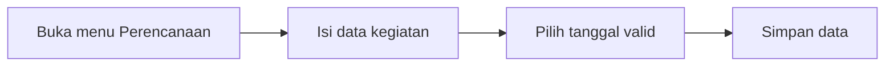
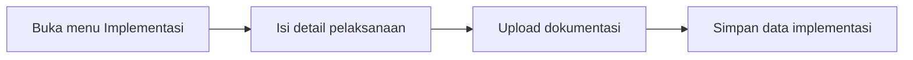
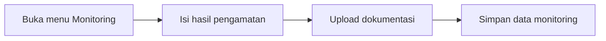
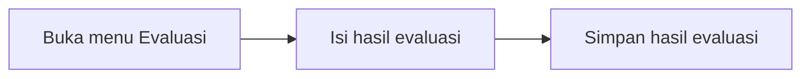
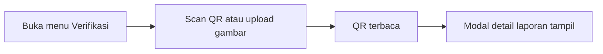

# Panduan Penggunaan Aplikasi

Dokumen ini merupakan panduan resmi penggunaan aplikasi **Peluk Bumi EMS**. Panduan disusun untuk membantu pengguna publik, pengguna terdaftar, dan administrator dalam memahami alur kerja utama pada frontend aplikasi.

## 1. Tujuan Dokumen

Panduan ini menjelaskan tata cara penggunaan fitur utama aplikasi, meliputi:

- akses aplikasi dan login
- pengisian data perencanaan
- pengisian data implementasi
- pengisian data monitoring
- pengisian data evaluasi
- verifikasi QR Code
- akses informasi publik

## 2. Ruang Lingkup Pengguna

### 2.1 Pengguna Publik

Pengguna publik dapat membuka halaman utama, membaca informasi umum, dan melakukan verifikasi QR Code tanpa login.

### 2.2 Pengguna Terdaftar

Pengguna terdaftar dapat mengakses dashboard sesuai peran akun untuk mengisi dan memantau data kegiatan.

### 2.3 Administrator

Administrator memiliki akses pengelolaan data yang lebih luas, termasuk pemantauan laporan dan verifikasi data lanjutan.

## 3. Struktur Menu Aplikasi

Setelah login, menu utama akan menyesuaikan dengan peran pengguna.

### 3.1 Menu untuk Pengguna dan Administrator

- Dashboard
- Perencanaan
- Implementasi
- Monitoring
- Evaluasi
- Informasi Evaluasi
- Verifikasi
- Settings

### 3.2 Menu untuk Pengguna Publik

- Landing page
- Verifikasi publik
- Monitoring access

## 4. Prasyarat Penggunaan

Sebelum menggunakan aplikasi, pastikan beberapa hal berikut:

- perangkat terhubung ke internet
- browser menggunakan versi yang mendukung kamera dan upload file
- kamera aktif, jika akan melakukan scan QR Code
- akun sudah tersedia, jika ingin masuk ke dashboard pengguna

## 5. Prosedur Penggunaan Aplikasi

## 5.1 Membuka Aplikasi

1. Buka alamat frontend aplikasi pada browser.
2. Sistem akan menampilkan halaman utama.
3. Pengguna dapat memilih login, verifikasi, atau membaca informasi umum yang tersedia.

[LandingPage.png](../public/screenshoot/LandingPage.png)

## 5.2 Login ke Sistem

1. Pilih menu **Login**.
2. Masukkan email dan kata sandi.
3. Klik tombol masuk.
4. Sistem akan mengarahkan pengguna ke dashboard sesuai peran.

[Login.png](../public/screenshoot/Login.png)
[Dashboard.png](../public/screenshoot/Dashboard.png)

## 5.3 Registrasi Akun

1. Pilih menu **Register**.
2. Isi data yang diminta pada form pendaftaran.
3. Simpan data akun.
4. Setelah akun berhasil dibuat, lakukan login.

[Register.png](../public/screenshoot/Register.png)

## 5.4 Mengisi Data Perencanaan

1. Buka menu **Perencanaan**.
2. Lengkapi data kegiatan yang diminta.
3. Pilih tanggal pelaksanaan yang valid.
4. Simpan data perencanaan.

Ketentuan:

- tanggal pelaksanaan tidak dapat diisi sebelum tanggal hari ini
- seluruh kolom wajib harus diisi sebelum data disimpan

[Perencanaan.png](../public/screenshoot/Perencanaan.png)

### Alur Ringkas Perencanaan

## 5.5 Mengisi Data Implementasi

1. Buka menu **Implementasi**.
2. Masukkan informasi pelaksanaan kegiatan.
3. Unggah dokumentasi jika diperlukan.
4. Simpan data implementasi.

Ketentuan unggahan dokumentasi:

- format yang didukung mengikuti informasi yang tampil pada form
- ukuran file memiliki batas maksimal
- jumlah file juga memiliki batas maksimal

[Implementasi.png](../public/screenshoot/Implementasi.png)
[Implementasi2.png](../public/screenshoot/Implementasi2.png)

### Alur Ringkas Implementasi

## 5.6 Mengisi Data Monitoring

1. Buka menu **Monitoring**.
2. Lengkapi hasil pengamatan lapangan.
3. Unggah dokumentasi bila diperlukan.
4. Simpan data monitoring.

Ketentuan unggahan dokumentasi:

- format file mengikuti dukungan pada form
- ukuran dan jumlah file dibatasi
- file yang tidak sesuai akan ditolak sistem

[Monitoring.png](../public/screenshoot/Monitoring.png)
[Monitoring2.png](../public/screenshoot/Monitoring2.png)
[Monitoring3.png](../public/screenshoot/Monitoring3.png)

### Alur Ringkas Monitoring

## 5.7 Mengisi Data Evaluasi

1. Buka menu **Evaluasi**.
2. Isi hasil evaluasi berdasarkan data lapangan.
3. Simpan hasil evaluasi.

Untuk memahami metode pengamatan secara umum, buka menu **Informasi Evaluasi**. Halaman tersebut menyajikan penjelasan yang bersifat umum dan tidak terikat pada satu lokasi atau tanggal tertentu.

[Evaluasi.png](../public/screenshoot/Evaluasi.png)
[Evaluasi2.png](../public/screenshoot/Evaluasi2.png)

### Alur Ringkas Evaluasi

## 5.8 Verifikasi QR Code

Halaman verifikasi digunakan untuk membaca QR Code dan menampilkan detail laporan dalam bentuk modal.

### A. Verifikasi menggunakan kamera

1. Buka menu **Verifikasi**.
2. Izinkan akses kamera bila diminta browser.
3. Arahkan kamera ke QR Code.
4. Tunggu hingga QR Code terbaca.
5. Sistem akan menampilkan modal detail laporan.

### B. Verifikasi menggunakan unggahan gambar

1. Buka menu **Verifikasi**.
2. Pilih area upload gambar QR Code.
3. Pilih file gambar dari perangkat.
4. Tunggu proses pembacaan file.
5. Jika berhasil, modal detail laporan akan muncul.

### C. Informasi yang tampil pada modal

Modal verifikasi menampilkan informasi publik, antara lain:

- ringkasan kegiatan yang dapat diakses publik
- tahapan saat ini
- data perencanaan
- ringkasan status beberapa tahapan
- TX Hash
- ringkasan evaluasi

[Verifikasi.png](../public/screenshoot/Verifikasi.png)
[Verifikasi2.png](../public/screenshoot/Verifikasi2.png)

### Alur Ringkas Verifikasi

## 5.9 Panduan Ilustrasi Screenshot

Untuk kebutuhan manual resmi, berikut rekomendasi penempatan gambar:
|-------|---------------------------------|----------------------------------|
| Nomor |         Nama Ilustrasi          |        Isi yang Disarankan       |
|-------|---------------------------------|----------------------------------|
|   1   | Halaman utama                   | landing page aplikasi            |
|   2   | Navigasi awal                   | tombol login dan verifikasi      |
|   3   | Form login                      | field email dan password         |
|   4   | Dashboard                       | tampilan setelah login           |
|   5   | Form registrasi                 | form pendaftaran akun            |
|   6   | Validasi registrasi             | notifikasi sukses                |
|   7   | Form perencanaan                | input data kegiatan              |
|   8   | Validasi tanggal                | pencegahan backdate              |
|   9   | Form implementasi               | pengisian progres kegiatan       |
|  10   | Upload dokumentasi implementasi | area unggah file                 |
|  11   | Validasi file implementasi      | pesan error batas file           |
|  12   | Form monitoring                 | pengisian monitoring             |
|  13   | Upload dokumentasi monitoring   | area unggah file                 |
|  14   | Validasi file monitoring        | pesan error file tidak valid     |
|  15   | Form evaluasi                   | pengisian evaluasi               |
|  16   | Informasi evaluasi              | halaman penjelasan umum          |
|  17   | Halaman verifikasi              | kondisi sebelum scan             |
|  18   | Hasil scan QR                   | QR Code berhasil dibaca          |
|  19   | Modal detail laporan            | ringkasan data publik            |
|  20   | Upload gambar QR                | verifikasi dari file gambar      |
|  21   | QR akses monitoring             | QR yang memuat tautan monitoring |
|  22   | Detail akses monitoring         | detail sebelum tindakan lanjut   |
|-------|---------------------------------|----------------------------------|

## 7. Tips Penggunaan

- Pastikan koneksi internet stabil.
- Izinkan kamera pada browser jika menggunakan scan QR.
- Gunakan pencahayaan yang cukup agar QR mudah terbaca.
- Jika kamera tidak aktif, coba pilih perangkat kamera lain.
- Jika unggahan gagal, periksa format, ukuran, dan jumlah file.

## 8. Troubleshooting Singkat

### Kamera tidak aktif

- Periksa izin kamera pada browser.
- Muat ulang halaman verifikasi.
- Tutup tab lain yang sedang menggunakan kamera.

### QR Code tidak terbaca

- Pastikan QR tidak buram atau terlalu kecil.
- Coba unggah gambar dengan kualitas yang lebih baik.
- Pastikan QR Code masih valid.

### File upload ditolak

- Periksa format file yang diunggah.
- Periksa ukuran file.
- Periksa jumlah file yang diunggah.

### Data tidak tampil

- Pastikan Anda login dengan akun yang benar.
- Muat ulang halaman.
- Hubungi administrator jika kendala masih terjadi.

## 9. Penutup

Dokumen ini disusun sebagai manual resmi penggunaan aplikasi frontend Peluk Bumi EMS. Untuk informasi teknis lanjutan, lihat dokumentasi lain pada folder `docs/`.
